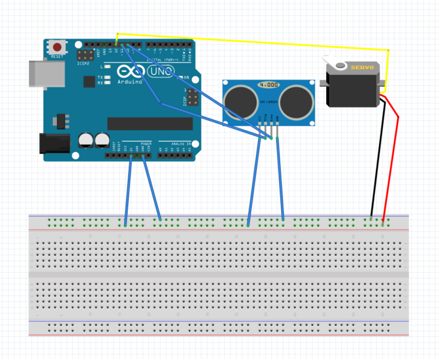
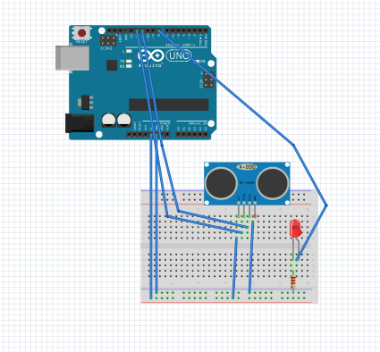

# HelloFunctions

## Description:
HelloFunctions was my first assignment in Engineering.The assignment is about trying to make a sensor work and tell the distance between the sensor and the object infront of it. The way the sensor will tell you the distance is by using the Serial monitor. Not just that but once the sensor finds the distance of an object it will move a servo for whatever the distance was of the object. Range of the sensor is pretty short though. The function of the sensor was to detect the distance and then send a message to the servo of the distance to move it and then the sensor will do it again once the servo resets its self.

## Code

## Wiring Diagram:

## Lessons:
Google is and will forever be my friend
the people around me can help me with my assignment.
Wiring is something harder than I thought and requires more pratice.

# NewPing() 

## Description:
This was my second assignment in Engineering class. NewPing() is an assignment that is like a "free for all." The assignment is
make something cool but simple. Like turning on and off a couple of LEDs in a pattern or at the same time or do something with the sensor. What I did though was an something of both LED and ultrasonic sensor. My sensor would do what a sensor does best and dectect an item and if it dectects an item it will turn on an LED.

# Code

## Wiring Diagram:

## Lessons:
 Sensors can do a lot more than what I originally thought.
 Sensors are more complicated than i thought.
 Asking isn't a tool of cowards its a tool of trying.
 
 
 
# LED Fade (LED Blink Revisited)

## Description:
This was like a review or a "blast from the past" sort of thing. The instructions are simple open up Sublime which is the new place for coding instead of Arduino. Make a code to make an LED blink and then after that make it fade in and out. Also make a wiring to make the LED work.

# Code

## Wiring Diagram:

## Lessons:
Even though this will certanly be the most easiest thing to do in engineering 2 its nice to have a recap on something basic. It can give you memories of when you first made an LED blink. Plus a recap on the basic doesn't hurt your mind it can help it remeber how circuit work when you haven't done any engineering for about 3 months it can refresh it.

# Hello LCD

## Description
Alright this was the assignment that teaches you how an LCD works. The first part was about soldering but I didn't do that part cause of some reason I don't remeber why. Oh wait I just read more about the LCD assignment and I just rememberded why I didn't do it. It was because my LCD already had pins in it. After that you'll have to wire the LCD. And i'm telling you right now the wiring  was a lot more than I thought it would be and it was confusing. There was a link about how to do the wiring here it is. https://learn.adafruit.com/character-lcds/wiring-a-character-lcd ( After that you'll make a code for it to work. But it would have to require these codes.

#include <LiquidCrystal.h>

LiquidCrystal lcd(7, 8, 9, 10, 11, 12); // Those are the pins for RS, EN, DB4, DB5, DB6, DB7, respectively

lcd.begin(16, 2);

lcd.setCursor(0,0);

lcd.print("stuff");

and if the this If that code throws an error, you might need to install the LiquidCrystal library. In Sublime, select Arduino -> Install Library -> Display -> L -> LiquidCrystal -> [the most recent one]. This was from the intructions. The objective in this assignment was to make the LCD say "Hello World" and a timer that counts every second its on.

## Code

## Wiring

## Lessons
The lesson here is that even thought the teacher may have given you some code you have to use that dosen't mean thas all you need. Cause thats what i thought. But luckly Google is a thing and it can help you soooooo much more than you would ever think.

# LCD Backpack

## Description
In this assignment you'll be working with the LCD again but a little bit diffrent this time. This time there will be no wires. This time you'll be using a 12C "backpack". Just match the pins with the right slot holes and you'll be in buisness. In this order GND to GND, VCC to 5V, SDA to A4, and SCL to A5.  Then stick its 16 pins into the LCD's 16 female pins. (this was taken from the Canvas instructions.) Also you'll have to instal a new library in this order  Sublime, select Arduino -> Install Library -> Display -> L -> LiquidCrystal I2C -> [the most recent one].  (This was also from Canvas) After that theres the code to make the 12C work with the LCD. Here it is. 

#include <Wire.h>

#include <LiquidCrystal_I2C.h> 

LiquidCrystal_I2C lcd(0x27,16,2);  // set the LCD address to 0x27 for a 16 chars and 2 line display.  

// If 0x27 doesn't work, try 0x3F.

(another part of the instruction)

In setup(), you'll need:

lcd.init()
lcd.backlight();

after all of this and your code from the other assignment LCD Hello World It should work and say Hello World with a timer. After all of this instructions its time for the assignment. The assignment is to add a button on your breadboard and make your LCD count the amount of times the button has been pressed. After that the "Even spicier" assignment is to makei it do that but with a switch and if the switvh is on one side the button will count up. I its in the other side then the amount of times you press the button will make it count down.

## Code

## wiring

## Lesson
After finishing this it was one of the first time I used CHS sigma. Think of it as Wikipedia only its from students in CHS who post their work so others don't have to stuggle like they did. It is a great web site for ideas or ways to make a wirirng or code for your assignments. If you use CHS sigma it will tottaly help you with your work.
